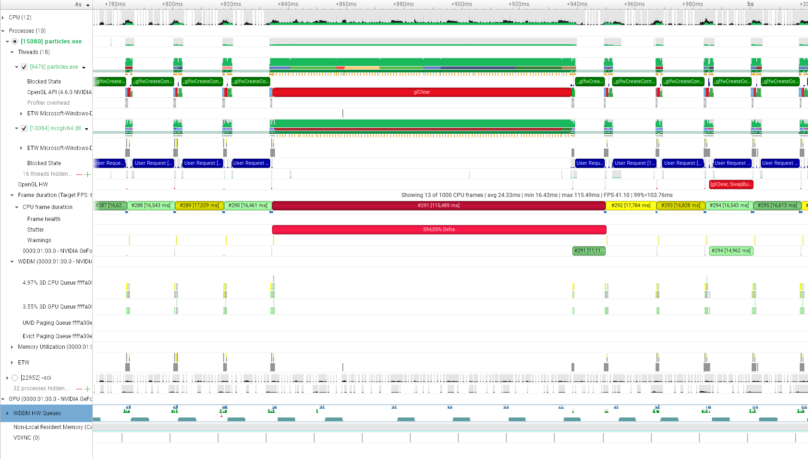
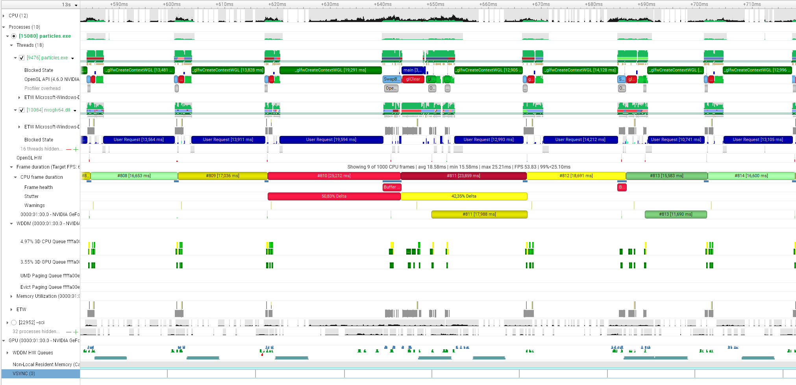
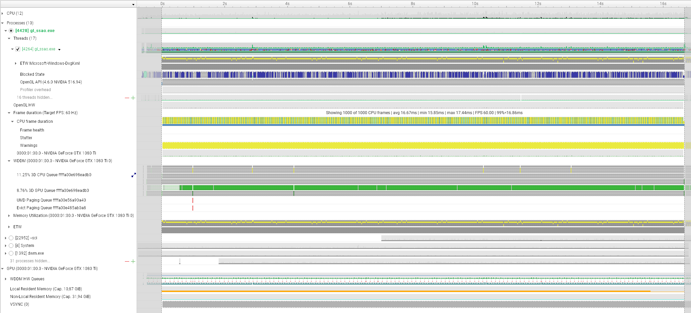
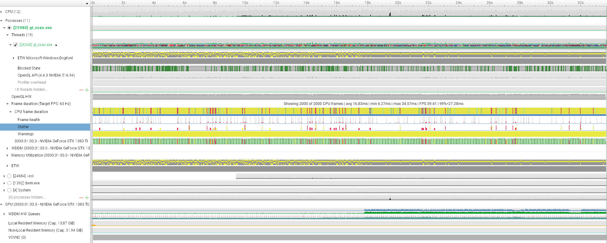
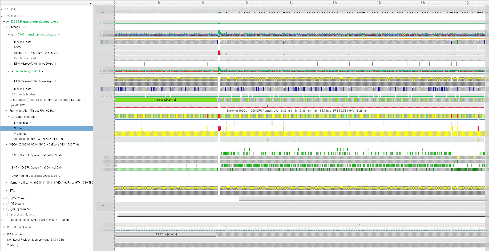
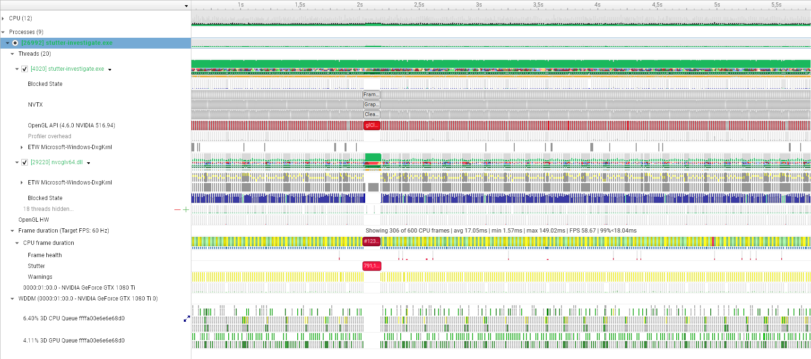

# Science!

## Measures

### Reports:

**Note**: To be published later

* Project 7 - glfw3.3.8-particles -> Report 2
* Project 6 - ssao -> Report 2
* Project 6 - ssao -> Report 8
* Project 1 - my-gameloop -> Report 8
* Project 8 - stutter-investigate -> Report 11

### Test on GLFW

3.3.6 (used by our current stack) and 3.3.8 (latest release), with similar behaviours.
Test ran on particles: it seems there are two different causes for the stutter:

1. Very long glClear, accompanied by 100% CPU usage.
  

2. \_glfwCreateContextWGL missing a frame-period (16.6ms) deadline.
  

(both: glfw3.3.8-particles -> Report 2)

In the second case, it either happens in pair like in the screenshot (summing to ~100% stutter) or in isolation.

### Test on Nvidia GL samples

* gl_cadscene_rendertechniques
* gl_ssao

Mostly no stutter. None of the kind above (sometimes a longer frame)

(ssao -> Report 2)

#### Modifications to use the default GLFW context even on Windows.

Based on changes made to a fork of [nvpro_core](https://github.com/Adnn/nvpro_core),
enabled by defining `GLFW_WIN_CONTEXT` macro.

The second kind of stutter (`_glfwCreateContextWGL`) is frequent, the first (`glClear`) seems absent:

(ssao -> Report 8)

### Custom Glfw 3.3.6 app

Stutter profile ressembling the glfw samples (with the two same kind of stutters):

(my-gameloop -> Report 8)
(see also: stutter-investigate -> Report 3)

#### Modifications to use the custom nvpro context creation on Windows.

The first kind of stutter (`glClear`) is still present, but the secodn (`_glfwCreateContextWGL`) seems absent.

(stutter-investigate -> Report 11)
(see also: stutter-investigate -> Report 9)

### Misc. observations:

When `glClear()` is blocking at 100% cpu usage in the application process, but is actually divided in several "usage" blocks (which migrate CPU, and can be individually selected).
These blocks seems to align with "Blocked states" ranges in an `nvwgf2umx_cfg.dll` thread of the `dwm.exe` process.

When setting the clear color each frame with `glClearBufferfv()` before the call to `glClear()`, this first call is blocking.

The blocking seems _somehow_ synchronized with some blocked state on the `DWM token thread` of `dwm.exe`.

## Conclusions

From the different observations above, we could make the following hypothesis:

1. There are two different kinds of stuttering involved, (1) when `glClear()` is blocking (usually for > 100ms) and (2) when `_glfwCreateContextWGL()` is blocking (usually summing to one frame).
   * This stuttering is present (on my environment) for both GLFW samples (even on latest release) and custom applications I am writing.

2. The nvpro OpenGL samples do not suffer from these stuttering.

   * Copying their custom context creation on Windows address stuttering (2) in a test application, but not stuttering (1).
   * Using the default GLFW context creation in the nvpro samples introduces stuttering (2), but does **not** introduces stuttering (1).
   * We could conclude that the custom context creation is addressing stuttering (2), but stuttering (1) is dependent of something else I was not able to identify.

# nvpro examples discovery

### Code architecture

    Sample -> AppWindowProfilerGL -> AppWindowProfiler -> NVPWindow

    sample.run() -> AppWindowProfilerGL.run()
      AppWindowProfilerGL.run()
        NVPWindow::open()
          // Configure GLFW_CLIENT_API
          glfwCreateWindow()
        AppWindowProfilerGL.contextInit()
          ContextWindow.init()
            ContextWindowInternalGL.init()
            Load_GL()
              // Ends up loading OpenGL functions via wglGetProcAddress()

        AppWindowProfiler.begin() -> sample.begin()
         // Init many things (Imgui init GL, initPrograms(), initScene...)

        AppWindowProfiler.think() -> sample.think()
          m_control.processActions() //camera controls
          processUI // imgui

### Of general interest

* ProfilerGL implements GPU sections timing
